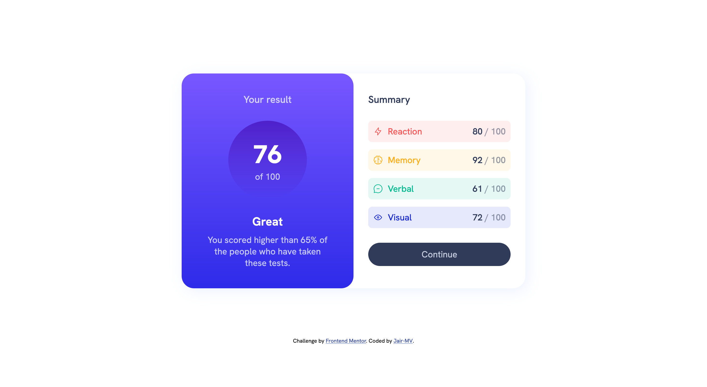

# Frontend Mentor - Results summary component solution

This is a solution to the [Results summary component challenge on Frontend Mentor](https://www.frontendmentor.io/challenges/results-summary-component-CE_K6s0maV). Frontend Mentor challenges help you improve your coding skills by building realistic projects.

## Table of contents

- [Overview](#overview)
  - [The challenge](#the-challenge)
  - [Screenshot](#screenshot)
  - [Links](#links)
- [Author](#author)

## Overview

### The challenge

Users should be able to:

- View the optimal layout for the interface depending on their device's screen size
- See hover and focus states for all interactive elements on the page
- **Bonus**: Use the local JSON data to dynamically populate the content

### Screenshot

### Links

- Solution URL: [https://github.com/Jair-MV/results-summary-component](https://github.com/Jair-MV/results-summary-component)
- Live Site URL: [https://results-summary-component-jmv.netlify.app/](https://results-summary-component-jmv.netlify.app/)

## Author

- Website - [Jair-MV](https://github.com/Jair-MV)
- Frontend Mentor - [@Jair-MV](https://www.frontendmentor.io/profile/Jair-MV)
